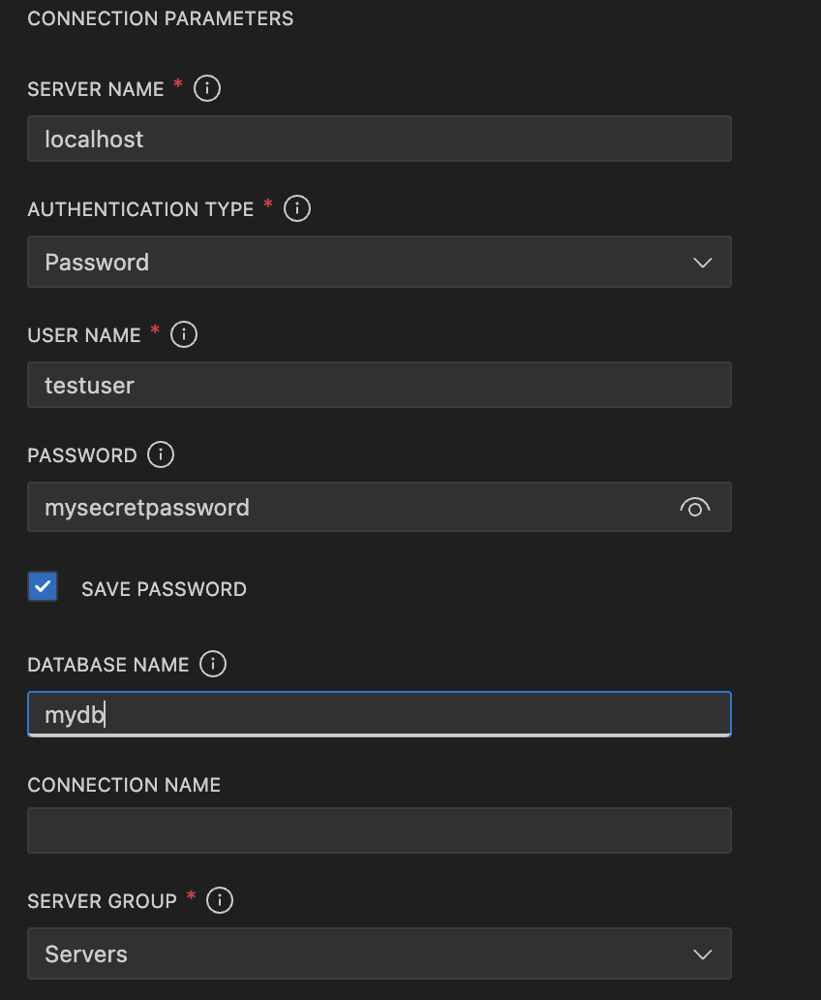

# Prerequisites

    - Python
    - Docker installed and running on machine
    - VS Code

# How to Run Code

With Docker up and running in VS Code, go to the Run and Debug button and select "Python: Run main.py".

This should successfully create/start the Docker Postgres container. It will also create a python virtual environment and install the required libraries from requirements.txt.

# How to View Postgres Database
To view the Postgres Database in VS Code, download the PostgreSQL extension.
Once that is download, click 'Add Connection'.

Add the following information to connect to the database:

# Approach to API Discovery

For my approach to API discovery, I googled each company to find public api documentation. For Cheap Airport Parking, where I could not find public api documentation, I knew I would have to look at the Network tab in developer tools to determine how to make the API call.

I also validated on the Ocra site, looking at the partnerships there, to ensure I was looking at the correct company.

Next, prior to writing any code for the API integrations, I used Postman to determine the exact request I would need to be making for each vendor integration. This helped ensure I had the right request body and API endpoint before spending time on code.

# Location Matching Approach

For my location matching approach, I knew I would have to use fields that were consistent across providers. Not every provider had an address provided, or the name of each lot would differ slightly. This made it difficult to determine if the facilities were the same or not.

I decided to match on latitude and longitude. These fields are unique to each parking lot and consistent across providers. While the precision of these fields (i.e. 33.00001 vs 33.0001) may differ between providers, I accounted for this by rounding to the fourth decimal point. 

An assumption I made was that the coordinates would be accurate up until the fourth decimal point. I also assumed that all providers would return geographical coordinates.

There are tradeoffs to this approach. One tradeoff is if there are multiple parking lots in close relativity to each other. This could cause coordinates to overlap and accidentally match with the incorrect parking lot. 

Another tradeoff would also be if the coordinates differ greatly between providers. For instance, if it was a large parking lot and one provider places the coordinates in the top right of the parking lot, and the other provider places them in the bottom left, the coordinates could differ just enough to not match.

An edge case was that some providers return a parking lot multiple times, for covered and not covered. For instance, SpotHero returned "WallyPark" three times, with the same coordinates. However, one was covered, one was uncovered, and the third one was Covered International parking. This would cause all three results to match.

# Notes on Scalability and Performance
Currently, this code calls one API at a time. To scale for more providers and more parking lots returned, I would run each API asychronously so that we do not have to wait for the first API call to finish before starting the next.

Additionally, I would add a caching layer for repeated calls. This would help reduce the number of API calls made in a short period of time. It would also save money if we were charged on a per call basis.

For the matching locations logic, I would most likely want to consolidate the logic to avoid having two different for loops.

For further scalability, I would want to implement the following ideas:
* Environment variables to ensure easy adaptability
* A secure connection to the database, with credentials secured in a keyvault
* Reconfigure the code so it does not fail if the database connection fails
* Add more thorough error handling

